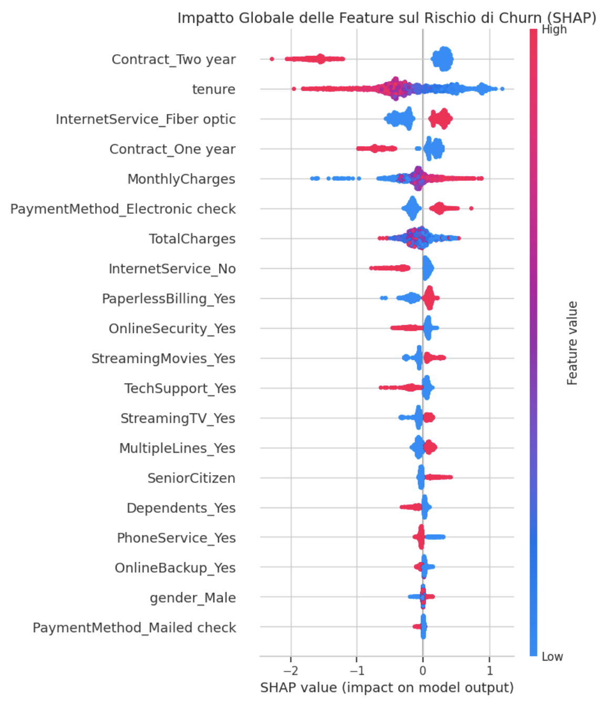
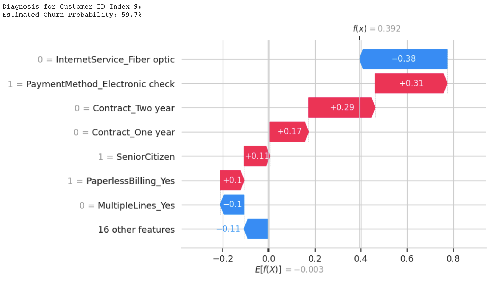

# Telco Customer Churn Prediction & Explainable AI (XGBoost + SHAP)

An end-to-end early warning churn detection pipeline designed to flag at-risk subscribers and explain the root causes of cancellation using Tree-based models and SHAP.

---

## 1. Business Context
Customer acquisition costs in telecom are estimated to be 5x to 7x higher than retention costs. Unplanned customer drop-off directly erodes recurring subscription cash flow and customer lifetime value (LTV).

The goal of this project is to build an interpretable classification system that detects churn signals with at least 30 days of lead time, enabling customer success teams to run proactive, personalized retention offers.

---

## 2. Technical Workflow

- **Dataset:** IBM Telco Customer Churn (~7,043 subscriber records, 20 features).
- **Data Engineering:** Parsed whitespace errors in `TotalCharges` for new accounts, converted binary categorical flags, and applied one-hot encoding across multi-class attributes.
- **Handling Class Imbalance:** Set `scale_pos_weight = 2.75` inside XGBoost to penalize false negatives on the minority churn class without introducing synthetic data artifacts (e.g., SMOTE).
- **Explainability:** Deployed `shap.TreeExplainer` to compute exact Shapley values for both macro-level feature rankings and account-level intervention decisions.

---

## 3. Model Performance & Interpretability

### Validation Metrics (Holdout Test Set)
- **ROC-AUC:** `0.84`
- **PR-AUC:** `0.65`
- **Recall (Churn Class):** `78%`

### Global Feature Drivers
The SHAP summary plot highlights the primary macro drivers determining whether an account cancels its contract:



- **Contract Commitment:** Month-to-month contracts are the single largest operational driver of churn.
- **Support Add-ons:** Absence of `TechSupport` and `OnlineSecurity` drastically elevates churn propensity.
- **Payment Method:** Electronic check payments introduce billing friction compared to automated card payments.

### Local Account-Level Diagnosis
Retention agents can inspect individual high-risk accounts prior to outreach to tailor personalized retention packages:



---

## 4. Business Impact & ROI

On a holdout test cohort of 1,409 customers:
- **True Positives (Identified Churners):** ~290 accounts.
- **Simulated Recovery Value:** Assuming an average retained CLV of €500 and a 40% win-back acceptance rate on a €50 proactive incentive, the model delivers an estimated **~€28,000+ in net preserved revenue** compared to baseline customer loss.

---

## 5. Strategic Recommendations

1. **Contract Migration Incentives:** Offer targeted 3-month discounts to transition month-to-month users into 1-year commitments during months 3–6.
2. **First-90-Days Feature Bundling:** Automatically include complimentary `TechSupport` trials during onboarding to reduce early-tenure drop-off.
3. **Automated Billing Promotions:** Provide a one-time bill credit for switching from electronic checks to automated direct debit or credit card payments.

---

## 6. Quickstart

Run directly in Google Colab:

[](https://colab.research.google.com/github/MRigoni10/telco-churn-explainable-ai/blob/main/notebooks/telco_churn.ipynb)

To run locally:

```bash
git clone [https://github.com/MRigoni10/telco-churn-explainable-ai.git](https://github.com/MRigoni10/telco-churn-explainable-ai.git)
cd telco-churn-explainable-ai
pip install -r requirements.txt
jupyter notebook
